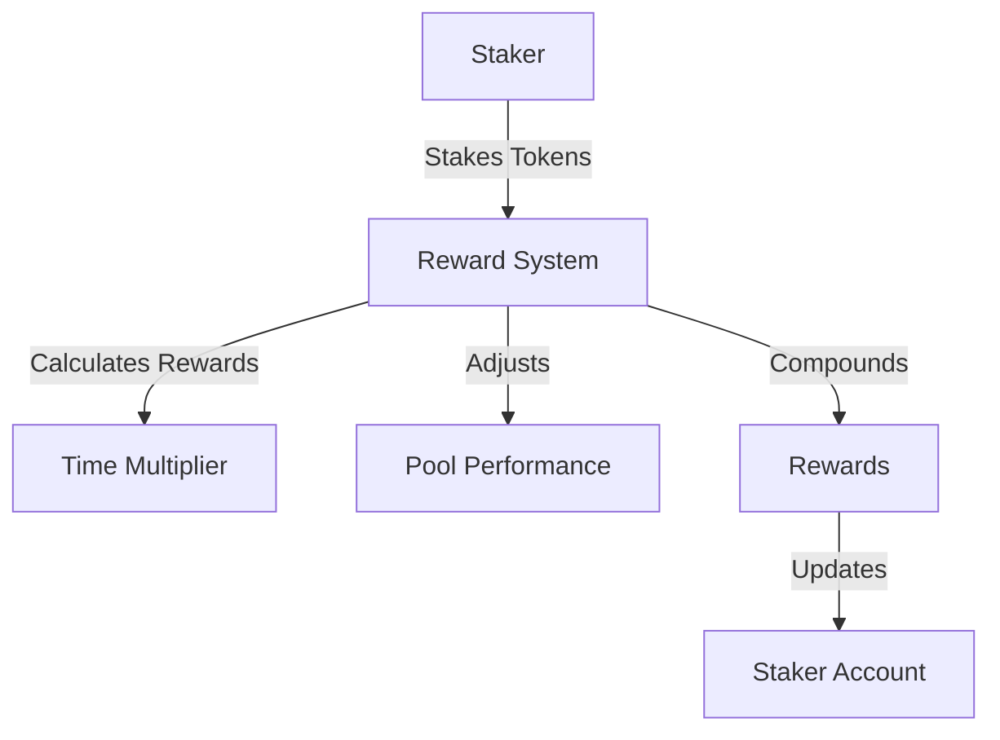

# Alephium Liquid Staking Reward System

A reward system implementation for liquid staking on Alephium blockchain, featuring time-weighted rewards, performance multipliers, and compound rewards.

## Features

- 🕒 Time-weighted rewards
  - 1.05x multiplier for 7+ days staking
  - 1.1x multiplier for 30+ days staking
- 📈 Pool performance adjustments
- 🔄 Compound rewards
- ⚖️ Fair reward distribution

## Architecture



## Getting Started

### Prerequisites

- Node.js v16+
- Docker
- npm or yarn

### Installation

```bash
# Clone the repository
git clone <repository-url>
cd liquid-staking

# Install dependencies
npm install

# Start the devnet (Interactive mode)
npm run devnet

# Or in detached mode
npm run devnet:detached

# Build contracts
npm run build

# Run tests
npm test
```

### Development Commands

```bash
# Watch mode for contract compilation
npm run build:watch

# View devnet logs
npm run devnet:logs

# Stop devnet
npm run devnet:stop

# Clean up devnet
npm run devnet:clean

# Run tests with CI configuration
npm run test:ci
```

## Contract Structure

### RewardSystem.ral

Main contract handling reward calculations and distribution:

- Time-weighted multipliers
- Pool performance adjustments
- Compound rewards logic

```solidity
Contract RewardSystem(
    tokenId: ByteVec,
    rewardTokenId: ByteVec,
    mut baseRewardRate: U256,
    mut poolPerformanceMultiplier: U256
)
```

## Testing

The project includes comprehensive tests covering:

- Base reward calculations
- Time-weighted multipliers
- Pool performance adjustments
- Compound rewards
- Edge cases

```bash
npm test
```

## Docker Configuration

The project includes Docker support for development:

```yaml
version: "3.8"
services:
  devnet:
    image: alephium/dev-env:latest
    ports:
      - "22973:22973"
      - "127.0.0.1:15973:15973"
```

## Project Structure

```
liquid-staking/
├── contracts/
│   ├── reward_system.ral       # Main reward contract
│   └── test/
│       └── test_token.ral      # Test token contract
├── test/
│   ├── reward_system.test.ts   # Reward system tests
│   └── utils.ts                # Test utilities
├── scripts/
│   └── deploy_reward_system.ts # Deployment script
└── docker-compose.yml          # Docker configuration
```

## Contributing

1. Fork the repository
2. Create your feature branch (`git checkout -b feature/amazing-feature`)
3. Commit your changes (`git commit -m 'Add some amazing feature'`)
4. Push to the branch (`git push origin feature/amazing-feature`)
5. Open a Pull Request

## Development Workflow

1. Start the devnet:

   ```bash
   npm run devnet:detached
   ```

2. Build and watch for changes:

   ```bash
   npm run build:watch
   ```

3. Run tests in another terminal:
   ```bash
   npm test
   ```
